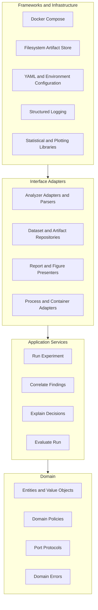
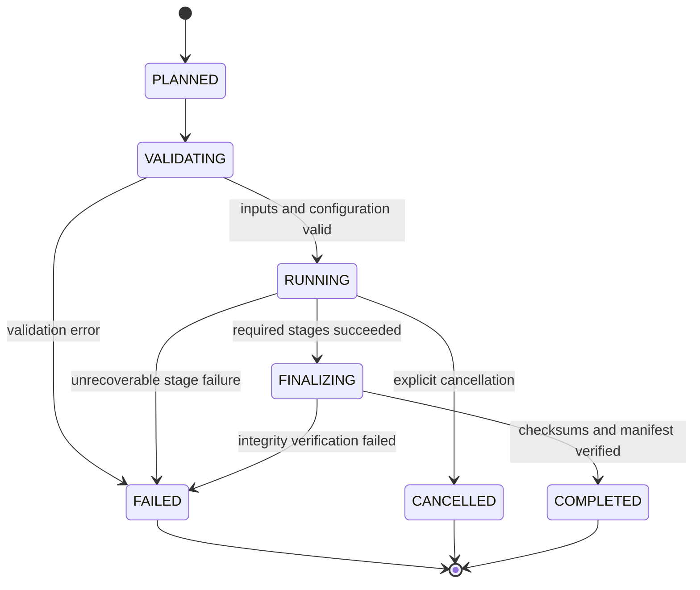
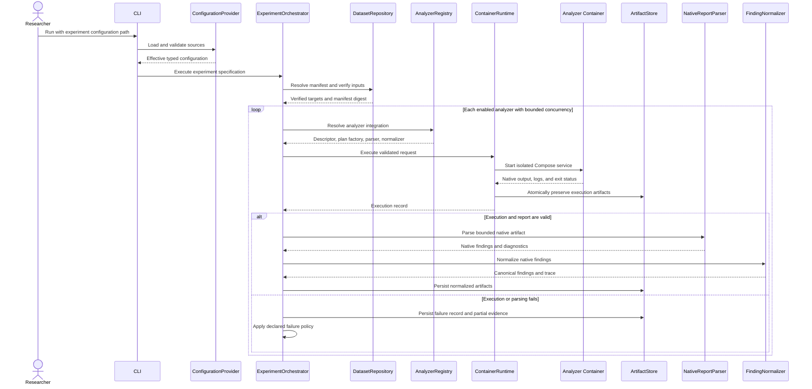
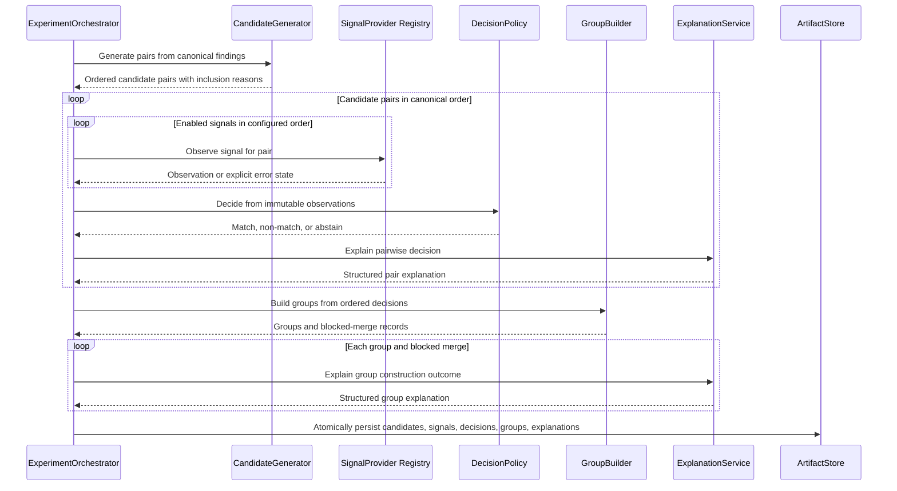
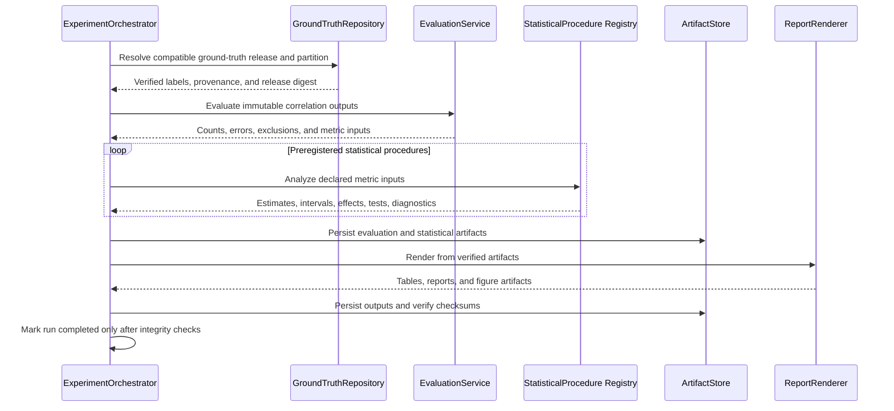
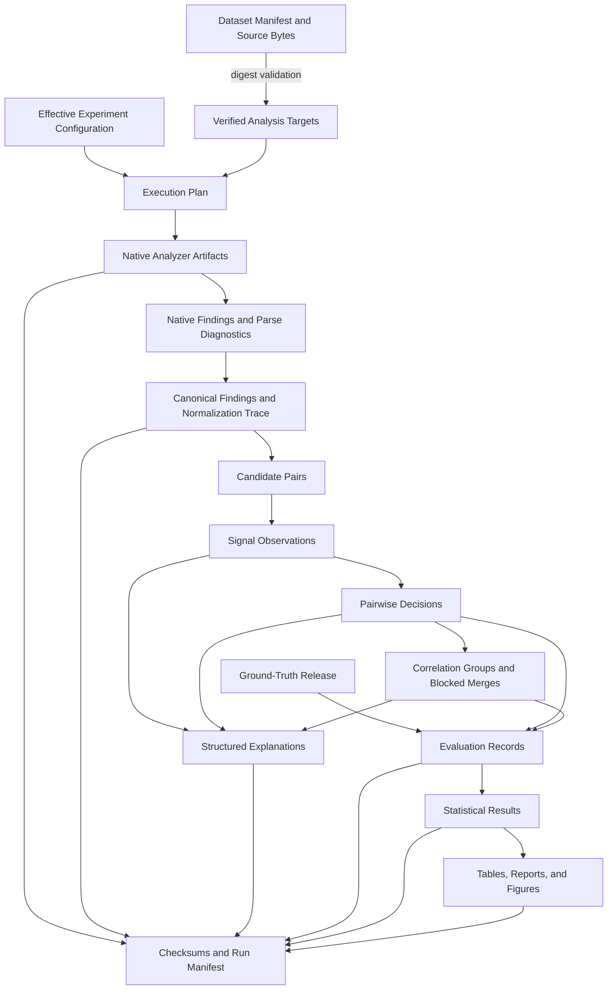

# XCorr Architecture

## 1. Purpose and scope

This document defines the implementation architecture for XCorr, an explainable multi-tool smart-contract vulnerability correlation framework. It is the authoritative boundary specification for source code, datasets, experiments, statistics, generated evidence, and analyzer integrations. Development may refine algorithms behind the interfaces defined here, but changes to layer boundaries, artifact contracts, dependency direction, identifiers, or reproducibility guarantees require an explicit architecture decision.

XCorr accepts smart-contract analysis targets and a versioned experiment specification, executes independently versioned analyzers in isolated containers, preserves their native outputs, normalizes findings into a canonical model, correlates findings using multiple explicit signals, explains every decision, and evaluates those decisions against versioned ground truth. It does not silently repair analyzer output, infer missing provenance, or treat incomplete runs as valid experimental evidence.

### 1.1 Architectural drivers

The architecture prioritizes:

1. **Research integrity:** every numerical claim is traceable to immutable inputs and generated artifacts.
2. **Explainability:** a correlation decision exposes its evidence, configuration, uncertainty, and provenance.
3. **Analyzer independence:** core behavior does not depend on a particular tool, output schema, taxonomy, or runtime image.
4. **Reproducibility:** effective configuration, dependency versions, image digests, seeds, data digests, and runtime facts are recorded.
5. **Isolation:** untrusted contracts and third-party analyzers execute within constrained Docker Compose services.
6. **Testability:** domain and application services use typed ports that can be replaced by in-memory test doubles.
7. **Determinism:** identical validated inputs and configuration produce byte-equivalent derived data wherever third-party analyzers permit deterministic execution.
8. **Failure transparency:** partial output and failures remain visible but cannot be promoted to completed experimental evidence.

### 1.2 Supported operating model

- Python 3.12 is the application runtime.
- Ubuntu 24.04 is the reference host platform.
- Docker Compose is the supported analyzer runtime and integration environment.
- The trusted control plane runs the CLI and orchestration code on the host or in a controlled Python environment. It invokes Docker Compose through a runtime port. The orchestrator container is not given the Docker socket.
- Analyzer containers receive read-only source inputs and a tool-specific writable output directory. They have no network access during analysis unless an experiment specification explicitly declares, justifies, and records a network requirement.
- Machine-readable artifacts are the source of truth. Human-readable reports, tables, figures, and paper content are derived views.

### 1.3 Non-goals

XCorr is not a replacement for individual analyzers, an autonomous vulnerability repair system, or a guarantee that an unreported vulnerability is absent. The core system does not execute deployed contracts, manage private keys, submit blockchain transactions, or use unpublished benchmark values as ground truth. Interactive dashboards may consume XCorr artifacts later, but UI concerns do not enter the domain model.

## 2. Overall system architecture

XCorr uses a ports-and-adapters form of Clean Architecture. The domain contains stable research concepts and invariants. Application services coordinate use cases through ports. Adapters translate analyzer, filesystem, container, configuration, and report concerns. Infrastructure supplies concrete Docker Compose, filesystem, serialization, hashing, clock, and process implementations.

```mermaid
flowchart LR
    User[Researcher or CI] --> CLI[XCorr CLI]
    CLI --> Config[Configuration Loader]
    Config --> Orch[Experiment Orchestrator]

    Orch --> Data[Dataset Repository]
    Orch --> Registry[Analyzer Registry]
    Orch --> Runtime[Container Runtime Port]
    Runtime --> Compose[Docker Compose Adapter]
    Compose --> Tools[Isolated Analyzer Containers]

    Tools --> Native[Native Tool Artifacts]
    Native --> Parsers[Analyzer Parsers]
    Parsers --> Normalize[Finding Normalizers]
    Normalize --> Canonical[Canonical Findings]

    Canonical --> Candidates[Candidate Generator]
    Candidates --> Signals[Correlation Signal Providers]
    Signals --> Policy[Decision Policy]
    Policy --> Groups[Deterministic Group Builder]
    Groups --> Explain[Explanation Service]

    Policy --> Evaluate[Evaluation Services]
    Groups --> Evaluate
    Explain --> Evaluate
    GroundTruth[Versioned Ground Truth] --> Evaluate

    Evaluate --> Stats[Statistical Analysis]
    Stats --> Reports[Reports and Tables]
    Stats --> Figures[Figures]
    Native --> Store[Artifact Store]
    Canonical --> Store
    Explain --> Store
    Evaluate --> Store
    Stats --> Store
    Store --> Manifest[Run Manifest and Checksums]
```



### 2.1 Control plane and data plane

The **control plane** validates configuration, determines the execution plan, manages state transitions, applies resource limits, records provenance, and decides whether a run is complete. It never interprets tool-native vulnerability semantics directly.

The **data plane** consists of analyzer containers, parsers, normalizers, correlation services, explanation services, and evaluation services. Each stage reads immutable upstream artifacts and writes a new versioned artifact. Stages do not mutate preceding artifacts.

### 2.2 Processing stages

An end-to-end run contains the following ordered stages:

1. Load, merge, validate, and materialize effective configuration.
2. Resolve the dataset manifest and verify every required digest.
3. Resolve analyzer descriptors and immutable container image identities.
4. Calculate the deterministic experiment specification identifier and run identifier.
5. Execute enabled analyzers with bounded parallelism and explicit resource limits.
6. Preserve native reports, standard output, standard error, exit status, duration, and runtime metadata.
7. Parse native reports without discarding unknown fields or diagnostics.
8. Normalize valid native findings into canonical findings and record normalization events.
9. Generate cross-tool candidate pairs using deterministic blocking rules.
10. Compute configured signals, preserving missing, failed, and inapplicable states.
11. Produce pairwise match, non-match, or abstain decisions.
12. Build correlation groups using a deterministic, conflict-aware grouping policy.
13. Generate machine-readable and human-readable explanations.
14. Evaluate eligible outputs against a compatible ground-truth release.
15. Run registered statistical analyses and generate reports and figures.
16. Verify artifacts, write checksums, and transition the run to `COMPLETED` only when all required stages succeed.

## 3. Clean Architecture layers

Dependencies point inward. Inner layers define contracts; outer layers implement them. No inner layer imports a concrete outer-layer implementation.



### 3.1 Domain layer

The domain layer contains immutable entities, value objects, identifiers, enums, validation rules, correlation evidence, decision policies, grouping invariants, and domain exceptions. Domain code accepts typed values and returns typed values. It performs no filesystem access, subprocess execution, environment access, logging configuration, network calls, plotting, or wall-clock reads.

The domain layer may depend on the Python standard library and Pydantic for immutable validation and serialization contracts. It must not depend on Docker, YAML parsers, analyzer SDKs, pandas, plotting libraries, or concrete repositories.

### 3.2 Application layer

The application layer implements use cases and stage coordination. It owns transaction boundaries, cancellation, retry eligibility, run-state transitions, and calls to domain policies. It depends only on domain types and port protocols. Clock, identifier, artifact, process, runtime, analyzer registry, and dataset access are injected.

Application services never call `subprocess`, open files directly, or read environment variables. Those operations belong to adapters.

### 3.3 Interface adapter layer

Adapters convert external representations into application and domain contracts:

- Analyzer parsers convert native JSON, SARIF, text, or database exports into typed native finding records.
- Normalizers translate analyzer-specific taxonomy and locations into canonical findings.
- Configuration adapters convert YAML and permitted environment values into validated settings.
- Artifact adapters serialize and deserialize versioned records.
- Container adapters translate execution requests into Docker Compose invocations.
- Presenter adapters convert verified evaluation records into tables, figures, and narrative reports.

Adapters may depend on domain and application ports. An analyzer adapter may not import another analyzer adapter.

### 3.4 Framework and infrastructure layer

Infrastructure contains concrete integrations with Docker Compose, the local filesystem, hashing, structured logging, operating-system processes, and scientific Python libraries. It is replaceable without changing domain policies. Infrastructure failures are translated into typed application errors at adapter boundaries while retaining the original exception as causal context.

## 4. Domain model

All persisted domain records contain `schema_version`. Persisted records are immutable after publication. New optional fields may be introduced in a backward-compatible schema revision; renamed fields, changed semantics, or changed required fields require a new major schema version and an explicit migration.

### 4.1 Identity and provenance

| Type | Required meaning and invariants |
| --- | --- |
| `ContentDigest` | Algorithm-qualified lowercase digest, initially SHA-256. It is calculated from bytes, never from a path or modification time. |
| `ExperimentSpecificationId` | SHA-256 of canonical effective configuration, dataset manifest digest, source revision, analyzer descriptors, image digests, and correlation/evaluation policy versions. Ephemeral timestamps and host paths are excluded. |
| `RunId` | SHA-256 of `ExperimentSpecificationId` plus the explicit non-negative replicate index. The same specification and replicate index cannot be overwritten. |
| `ArtifactId` | Digest of the immutable artifact bytes plus its schema identifier. |
| `FindingId` | Digest of analyzer identity, target identity, native finding identity when stable, canonical source range, native rule identity, and native evidence digest. |
| `DecisionId` | Digest of the canonically ordered finding IDs, signal-set version, and decision-policy version. |
| `GroupId` | Digest of the sorted member finding IDs and grouping-policy version. |

Canonical serialization uses UTF-8 JSON with sorted object keys, no insignificant whitespace, finite numeric values, normalized path separators, and stable enum values. Content identifiers exclude recorded-at timestamps, durations, hostnames, and absolute paths.

### 4.2 Core entities and value objects

| Model | Core fields | Invariants |
| --- | --- | --- |
| `DatasetManifest` | identity, version, license/access policy, source entries, selection criteria, preprocessing lineage, file digests | Every consumed input is declared and digest-verified. Restricted data records acquisition instructions and digests without embedding protected content. |
| `AnalysisTarget` | target ID, dataset ID, repository-relative path, contract name, compiler metadata, source digest | Paths are normalized POSIX-relative paths without `..`; source bytes match the digest. |
| `AnalyzerDescriptor` | analyzer ID, adapter version, tool version, image reference, image digest, supported input/output versions, configuration schema version | Analyzer ID is stable and lowercase; mutable image tags alone are invalid for publishable runs. |
| `ExecutionRequest` | run ID, analyzer descriptor, targets, effective tool configuration, resource policy, input/output mount descriptors | Mounts are explicit; inputs are read-only; time, CPU, memory, process, and output limits are positive. |
| `ExecutionRecord` | request digest, start/end metadata, exit status, timeout or termination reason, runtime version, image digest, stdout/stderr/native artifact IDs | A successful process exit does not imply a valid report; parser validation is recorded separately. |
| `NativeFinding` | analyzer ID, native rule ID, native severity/confidence, native message, native location, retained native attributes, native artifact ID | Native values are preserved verbatim where serializable; unknown fields are retained in a namespaced map. |
| `SourceRange` | source digest, repository-relative path, start/end byte offsets, optional line/column projection | Byte range is half-open `[start, end)` over the exact UTF-8 source bytes. Lines are one-based and columns are zero-based Unicode code-point offsets. Derived line/column data must agree with byte offsets. |
| `VulnerabilityClass` | taxonomy ID, taxonomy version, canonical class ID, analyzer rule mapping ID, mapping confidence | The mapping refers to a versioned taxonomy file. An unmapped native rule remains explicit rather than receiving a guessed class. |
| `EvidenceItem` | evidence ID, kind, source artifact ID, structured payload, reliability metadata | Evidence is append-only, provenance-linked, and typed as location, taxonomy, semantic, structural, textual, execution, or provenance evidence. |
| `Finding` | finding ID, analyzer descriptor ID, target ID, native finding ID, vulnerability class, source ranges, evidence IDs, normalized severity/confidence, normalization trace | At least one native artifact and normalization trace are required. Native and normalized values remain distinguishable. |
| `NormalizationEvent` | normalizer version, input field, output field, operation ID, outcome, diagnostic | Every lossy conversion, default, rejected value, and unmapped value is visible. Silent fallback is forbidden. |
| `CandidatePair` | canonically ordered distinct finding IDs, blocking-rule version, inclusion reasons | Pair order is lexical by ID; pair members come from different analyzer executions unless a configured research question explicitly enables within-tool analysis. |
| `SignalObservation` | candidate pair ID, signal ID/version, status, raw value, normalized value, evidence references, diagnostic | Status is one of `OBSERVED`, `MISSING`, `NOT_APPLICABLE`, or `ERROR`. Missing or failed signals are never encoded as numeric zero. Normalized numeric values are finite and bounded as defined by the signal contract. |
| `CorrelationDecision` | decision ID, candidate pair ID, policy version, outcome, score or calibrated probability, threshold set, signal observation IDs, rationale codes | Outcome is `MATCH`, `NON_MATCH`, or `ABSTAIN`. Abstention is required when configured minimum evidence is absent or a policy cannot produce a valid decision. |
| `CorrelationGroup` | group ID, sorted finding IDs, accepted decision IDs, blocked merge IDs, grouping-policy version | A group contains at least two findings. Every merge satisfies the active grouping invariants. Singleton findings remain ungrouped findings rather than artificial groups. |
| `Explanation` | subject ID, explanation schema/version, summary, supporting factors, opposing factors, missing evidence, provenance links, configuration links | All factual statements are derivable from referenced records. Rendered text is a view of the structured explanation. |
| `GroundTruthRecord` | release ID, target ID, finding IDs or underlying-defect ID, label, annotator-independent adjudication state, evidence, provenance | Unadjudicated or incompatible records cannot be used as final labels. Training/tuning and evaluation partitions are explicit. |
| `EvaluationResult` | run ID, ground-truth release ID, metric specification, estimate, interval, sample count, exclusions, artifact IDs | Undefined metrics remain undefined with a reason; no division-by-zero substitution is permitted. |
| `RunManifest` | run ID, specification ID, replicate index, state, effective configuration artifact, input/output artifacts, versions, seeds, stage records, checksums | Only a fully verified manifest may have state `COMPLETED`. A manifest never hides failed or skipped required stages. |

### 4.3 Aggregate boundaries

- `RunManifest` is the aggregate root for lifecycle state, but it references artifacts by immutable ID rather than embedding all results.
- `Finding` is the normalization aggregate and owns its source ranges, vulnerability mapping reference, evidence references, and normalization trace.
- `CorrelationDecision` is the pairwise decision aggregate. A group references decisions; it never rewrites them.
- `EvaluationResult` is bound to one run, one ground-truth release, one metric specification, and one declared population.

### 4.4 Run state machine



Completed manifests and referenced artifacts are immutable. A retry creates a new explicit replicate index or a separately recorded execution attempt; it does not overwrite the failed run.

## 5. Component interactions

### 5.1 Required application ports

Ports are Python 3.12 typed protocols. Inputs and outputs are domain or application models, not untyped dictionaries.

| Port | Responsibility |
| --- | --- |
| `ConfigurationProvider` | Load sources, apply documented precedence, validate schemas, and return redacted and full effective configurations. |
| `DatasetRepository` | Resolve manifests and targets, verify digests, and expose read-only target descriptors. |
| `AnalyzerRegistry` | Resolve an enabled analyzer ID to a compatible descriptor, parser, normalizer, and execution-plan factory. |
| `ContainerRuntime` | Execute a validated request through Docker Compose and return an execution record without interpreting findings. |
| `ArtifactStore` | Atomically write, open, verify, enumerate, and seal immutable artifacts beneath a validated run root. |
| `NativeReportParser` | Parse bounded native output into native findings and parser diagnostics. |
| `FindingNormalizer` | Convert native findings into canonical findings and normalization events. |
| `CandidateGenerator` | Generate deterministic candidate pairs and inclusion reasons. |
| `SignalProvider` | Produce one versioned signal observation for a candidate pair. |
| `DecisionPolicy` | Convert an ordered observation set into match, non-match, or abstain. |
| `GroupBuilder` | Construct deterministic groups from immutable pairwise decisions without violating cannot-link constraints. |
| `ExplanationService` | Construct structured explanations from decisions, observations, evidence, and policy configuration. |
| `GroundTruthRepository` | Resolve a compatible, immutable ground-truth release and declared evaluation partition. |
| `MetricCalculator` | Calculate one registered metric and its required count data. |
| `StatisticalProcedure` | Calculate a registered interval, effect size, hypothesis test, or correction from declared inputs. |
| `ReportRenderer` | Render verified machine-readable results without recalculating or altering them. |
| `Clock` | Supply timestamps for provenance only; algorithms must not use wall-clock values as decision inputs. |

### 5.2 Analyzer execution sequence



### 5.3 Correlation and explanation sequence



### 5.4 Evaluation and publication sequence



## 6. Data flow and artifact contracts

### 6.1 Data-flow properties

- Data moves forward through explicit stages; derived stages never edit their inputs.
- Native tool output is retained before parsing.
- Normalization is a documented transformation, not an overwrite.
- Candidate generation is separated from decision scoring so recall loss can be measured independently.
- Signal calculation is separated from decision policy so ablations and policy comparisons reuse identical observations.
- Grouping is separated from pairwise decisions so transitive grouping effects can be evaluated independently.
- Explanation records are generated from structured decision evidence, not reconstructed from human-readable logs.
- Evaluation reads sealed correlation artifacts and a sealed ground-truth release.
- Reports and figures read evaluation/statistical artifacts only; they do not independently recalculate metrics from analyzer output.



### 6.2 Run artifact layout

Each run is rooted at `experiments/runs/<run_id>/`. The store rejects symlinks, absolute child paths, traversal segments, and writes outside this root.

```text
experiments/runs/<run_id>/
├── manifest.json
├── checksums.sha256
├── configuration/
│   ├── effective.redacted.json
│   └── provenance.json
├── inputs/
│   ├── dataset-manifest.json
│   └── source-index.jsonl
├── analyzers/
│   └── <analyzer_id>/
│       ├── execution.json
│       ├── stdout.log
│       ├── stderr.log
│       ├── native/
│       ├── parsed-findings.jsonl
│       └── parser-diagnostics.jsonl
├── normalized/
│   ├── findings.jsonl
│   └── normalization-events.jsonl
├── correlation/
│   ├── candidates.jsonl
│   ├── signal-observations.jsonl
│   ├── decisions.jsonl
│   ├── groups.jsonl
│   ├── blocked-merges.jsonl
│   └── explanations.jsonl
├── evaluation/
│   ├── ground-truth-reference.json
│   ├── records.jsonl
│   ├── metrics.json
│   └── exclusions.jsonl
├── statistics/
│   ├── analysis-plan.json
│   └── results.json
├── reports/
└── figures/
```

Files are written to a temporary file within the same filesystem, flushed, synchronized when configured, digest-verified, and atomically renamed. The manifest is finalized last. A `COMPLETED` manifest is invalid if any referenced artifact is absent, has a mismatched digest, violates its schema, or is not listed in `checksums.sha256`.

### 6.3 Configuration precedence

Configuration precedence, from lowest to highest, is:

1. versioned base configuration;
2. versioned environment profile;
3. versioned experiment specification;
4. explicitly permitted environment variables for secrets or host-specific paths;
5. narrowly scoped CLI operational options such as configuration path, dry-run, and log level.

Research parameters, thresholds, tool options, seeds, dataset selection, and exclusions cannot be overridden by ad hoc CLI flags. Unknown configuration keys are errors. The effective configuration and source provenance are persisted before execution. Secret values are used only by adapters that require them, are excluded from content identifiers, and are replaced by stable redaction markers in stored configuration.

### 6.4 Deterministic correlation behavior

Candidate generators emit unique pairs ordered by `(left_finding_id, right_finding_id)`. Signal providers are invoked in configured order and emit records ordered by signal ID. The decision policy consumes this ordered set. Parallel computation may change completion order but not persisted order.

The default group builder uses conservative complete-link compatibility:

- candidate match edges are considered by descending decision score, then lexical decision ID;
- groups merge only when every available cross-group pair is `MATCH`;
- any `NON_MATCH`, `ABSTAIN`, signal error required by policy, or missing required cross-pair blocks the merge;
- every blocked merge is persisted with the decisions that caused it;
- grouping does not convert an abstention into an implicit match through transitivity.

Alternative grouping policies are permitted only as versioned `GroupBuilder` implementations selected in configuration and evaluated as separate experimental conditions.

## 7. Dependency rules

The following rules are mandatory and enforceable through import tests, static analysis, and code review:

1. Domain modules import only the standard library, domain modules, and approved model-validation primitives.
2. Application modules import domain types and port protocols, never concrete adapters.
3. Analyzer adapters import shared analyzer contracts and domain models, never orchestrator internals or another analyzer.
4. Correlation signal providers do not import decision policies, group builders, evaluation code, or renderers.
5. Explainability reads structured domain evidence; correlation code does not depend on rendered explanations.
6. Evaluation imports immutable result contracts, not analyzer parsers or Docker infrastructure.
7. Statistical procedures consume declared evaluation tables or records, not mutable global data frames or native analyzer output.
8. Figure and report generation consumes verified statistical artifacts and may not redefine metrics.
9. Configuration is passed explicitly. Domain and application functions do not call `os.getenv` or read global settings.
10. Time, randomness, filesystem, subprocess, network, and container operations enter through injected ports.
11. Logging is observational. Business decisions cannot depend on log handlers, verbosity, or serialized log text.
12. No module changes the process working directory, module search path, global random state, locale, or timezone.
13. Public functions, methods, attributes, and serialized fields are typed. Untyped analyzer payloads are contained at parser boundaries and validated before use.
14. Circular imports between top-level modules are prohibited. Shared concepts move inward into domain contracts rather than into a new cross-module utility dependency.
15. Tests may depend on any production layer needed by the test, but production code never imports test fixtures or test helpers.

### 7.1 Allowed dependency matrix

| From | May depend on |
| --- | --- |
| Domain models and policies | Standard library, validated model primitives |
| Application orchestration | Domain, application ports |
| Analyzer integrations | Domain, analyzer contracts, application ports implemented by the adapter |
| Correlation implementations | Domain correlation contracts |
| Explainability implementations | Domain decisions, observations, evidence, explanation contracts |
| Evaluation implementations | Domain results, evaluation contracts |
| Statistics implementations | Evaluation records, statistical contracts, scientific libraries |
| Reports and figures | Verified evaluation/statistical artifacts, rendering libraries |
| Infrastructure | Domain and application ports, external frameworks |
| Scripts and CLI | Application use cases, composition root, configuration adapters |

## 8. Module responsibilities

| Module | Responsibilities | Must not contain |
| --- | --- | --- |
| `analyzers/` | Shared analyzer contracts; one isolated adapter package per tool; descriptor loading; invocation-plan construction; bounded native parsers; taxonomy mappings; normalization rules; adapter contract tests. | Cross-tool decision policy, evaluation metrics, report rendering, direct orchestration state mutation. |
| `orchestrator/` | Use cases; dependency composition; execution planning; bounded concurrency; stage state; retry and cancellation policy; manifest finalization; typed application errors. | Tool-specific parsing, vulnerability taxonomy guesses, statistical formulas, figure styling. |
| `correlation/` | Canonical correlation entities; blocking and candidate generation; signal contracts and providers; calibration interfaces; decision policies; deterministic group builders. | Container execution, native output parsing, ground-truth mutation, report rendering. |
| `explainability/` | Structured explanation schema; factor attribution; evidence and configuration linking; pair/group explanation services; deterministic text and JSON renderers. | Recalculation of signals, alteration of decisions, unsupported natural-language claims. |
| `evaluation/` | Ground-truth contracts; split eligibility; pairwise and group-level metrics; calibration and error analysis; exclusion accounting; metric registries. | Ground-truth fabrication, analyzer execution, publication layout. |
| `datasets/` | Dataset manifests; schemas; acquisition and verification metadata; preprocessing specifications; annotation protocol resources; permitted redistribution-safe data. | Undocumented downloaded data, secrets, mutable run results. |
| `experiments/` | Versioned experiment specifications and immutable run roots; preregistered hypotheses and analysis plans. | Hand-edited completed metrics, figures, or analyzer outputs. |
| `reports/` | Deterministic report and table renderers plus generated outputs in designated ignored paths. | Independent metric definitions or source observations. |
| `figures/` | Versioned visual specifications, shared publication style, deterministic figure renderers, generated images. | Hand-entered numerical values or manually altered publication figures. |
| `statistics/` | Registered statistical procedures, effect sizes, interval estimation, hypothesis tests, multiplicity correction, assumptions and diagnostics. | Data collection, analyzer parsing, hidden exclusions, unregistered post-hoc substitutions. |
| `configs/` | Base settings, environment profiles, analyzer settings, resource policies, taxonomy mappings, logging settings, experiment schemas. | Secrets, machine-specific committed paths, generated effective configurations. |
| `docker/` | Compose definition, analyzer Dockerfiles or immutable image metadata, health checks, entrypoints, resource/security defaults. | Research logic, embedded credentials, mutable unverified tool downloads. |
| `scripts/` | Thin typed operational entry points for setup, validation, execution, reproduction, and artifact verification. | Domain algorithms, duplicated configuration parsing, silent exception handling. |
| `tests/` | Unit, property, contract, integration, security, regression, and reproducibility tests; redistribution-safe fixtures derived from documented sources or purpose-built test contracts. | Production runtime dependencies on test code, fabricated benchmark results presented as observations. |
| `docs/` | Architecture, ADRs, schemas, protocols, security model, operations, contribution guidance, and traceability documentation. | Unverified experimental claims. |
| `paper/` | Manuscript sources, bibliography, generated tables/figures, and claim-to-artifact traceability. | Manually copied numerical results without artifact identifiers. |

### 8.1 Internal module pattern

Executable top-level modules use consistent internal boundaries where applicable:

- `domain/` for entities, value objects, invariants, and domain errors;
- `application/` for use cases and ports;
- `adapters/` for external representation translation;
- `infrastructure/` for concrete framework integrations;
- `composition.py` as the only composition root for wiring concrete dependencies.

Small modules do not need empty directories merely to mirror this pattern. A source file belongs to the innermost layer capable of owning its behavior. Cross-cutting convenience modules named `common`, `helpers`, or `utils` are not accepted without a single cohesive responsibility and an explicit dependency owner.

## 9. Extension points for future analyzers

### 9.1 Analyzer plugin contract

Analyzer integrations are discovered through the Python entry-point group `xcorr.analyzers`. An entry point resolves to an adapter factory that returns a typed integration bundle containing:

- one `AnalyzerDescriptor` provider;
- one execution-plan factory;
- one bounded `NativeReportParser`;
- one `FindingNormalizer`;
- supported configuration and native-output schema versions;
- compatibility checks for tool, adapter, taxonomy mapping, and image versions.

Only entry-point names explicitly enabled in configuration are loaded. Discovery order never affects execution or persisted ordering. Duplicate analyzer IDs, incompatible API versions, missing image digests, or unrecognized configuration fields fail during validation.

### 9.2 Required contents of an analyzer integration

A new integration under `analyzers/<analyzer_id>/` contains cohesive implementation code and versioned resources for:

1. descriptor and compatibility metadata;
2. a declarative configuration schema with safe defaults;
3. an execution request builder that uses an argument vector rather than a shell command string;
4. a bounded parser that validates actual tool output and preserves unknown fields;
5. explicit native-to-canonical taxonomy mappings with mapping provenance;
6. source-location normalization against exact source bytes;
7. structured diagnostics and typed failures;
8. a Dockerfile or immutable external image descriptor;
9. license-compatible native-output fixtures;
10. unit, parser contract, malformed-output, timeout, resource-limit, and integration tests.

### 9.3 Analyzer lifecycle

An analyzer progresses through `EXPERIMENTAL`, `SUPPORTED`, `DEPRECATED`, and `REMOVED` compatibility states. State reflects integration support, not analyzer quality. Promotion to `SUPPORTED` requires pinned runtime identity, passing contract tests, documented native schema coverage, deterministic-output characterization, resource-limit behavior, and version compatibility documentation.

Adding an analyzer must not require changes to candidate generation, decision policy, grouping, evaluation, or explanation services. A genuinely new canonical evidence kind or taxonomy semantic requires a versioned domain-schema decision before adapter implementation.

### 9.4 Additional extension points

The same registry pattern applies to:

- candidate generators;
- correlation signal providers;
- calibration methods;
- decision policies;
- group builders;
- explanation renderers;
- metrics;
- statistical procedures;
- report and figure renderers;
- artifact-store implementations.

Every extension declares a stable ID, semantic version, input schema version, output schema version, deterministic-behavior statement, configuration schema, and compatibility predicate. Experimental comparisons select extension IDs through versioned configuration rather than conditionals embedded in orchestration code.

## 10. Architectural design decisions

The concise ADRs below are binding. Expanded history and superseding decisions belong in `docs/DECISIONS.md`.

### ADR-001: Clean Architecture with inward dependencies

- **Status:** Accepted
- **Context:** Analyzer runtimes, correlation methods, and research outputs evolve at different rates.
- **Decision:** Domain and application policies are isolated behind typed ports; frameworks and analyzers remain replaceable adapters.
- **Consequences:** Composition is explicit and more interfaces exist, but core behavior is independently testable and analyzer changes do not propagate across the system.

### ADR-002: Immutable, content-addressed research artifacts

- **Status:** Accepted
- **Context:** Publication claims require an auditable chain from inputs to outputs.
- **Decision:** Stage outputs are immutable, digest-addressed, schema-versioned, and referenced by a finalized run manifest.
- **Consequences:** Storage use increases and corrections create new artifacts, but overwrite ambiguity and undocumented manual edits are eliminated.

### ADR-003: Preserve native output before normalization

- **Status:** Accepted
- **Context:** Normalization can lose tool-specific semantics and parser behavior can change.
- **Decision:** Native output, logs, exit facts, parsed native findings, canonical findings, and normalization events are distinct artifacts.
- **Consequences:** Reprocessing and parser audits are possible; storage and schema management are more demanding.

### ADR-004: Multi-signal correlation with explicit missingness

- **Status:** Accepted
- **Context:** Location, taxonomy, semantic, structural, textual, and provenance signals have different availability and reliability.
- **Decision:** Each signal emits an independently versioned observation with explicit observed, missing, inapplicable, or error status. Decision policy is a separate component.
- **Consequences:** Ablation and error analysis are reliable; policies must handle a larger structured input space.

### ADR-005: Abstention is a first-class decision

- **Status:** Accepted
- **Context:** Forced binary decisions conceal insufficient or conflicting evidence.
- **Decision:** Pairwise outcomes include `ABSTAIN`, and evaluation reports coverage and selective performance alongside match quality.
- **Consequences:** Some findings remain unresolved, but uncertainty is not misrepresented as agreement.

### ADR-006: Conservative deterministic grouping

- **Status:** Accepted
- **Context:** Connected components can convert weak transitive chains into false multi-finding groups.
- **Decision:** The default builder uses complete-link compatibility, explicit cannot-link constraints, canonical ordering, and persisted blocked-merge evidence.
- **Consequences:** Group recall may be lower than unconstrained transitive closure, while false chained merges and order-dependent results are reduced.

### ADR-007: Docker Compose analyzer isolation without Docker-socket mounting

- **Status:** Accepted
- **Context:** Analyzers process untrusted code and may include complex third-party dependencies.
- **Decision:** A trusted host-side runtime adapter invokes constrained Compose services. The application container never receives the Docker socket.
- **Consequences:** End-to-end execution requires a compatible host Docker installation; container escape impact and control-plane privilege are reduced.

### ADR-008: Externalized, validated, materialized configuration

- **Status:** Accepted
- **Context:** Hidden flags and environment-dependent defaults prevent experiment reproduction.
- **Decision:** Research behavior comes from strict versioned schemas, and each run stores its effective configuration and provenance.
- **Consequences:** Configuration migrations require care, but experiment intent becomes inspectable and hashable.

### ADR-009: JSON and JSON Lines as canonical persisted records

- **Status:** Accepted
- **Context:** Artifacts must be portable, diffable, streamable, and independent of Python object serialization.
- **Decision:** Bounded records use versioned UTF-8 JSON; large homogeneous record sets use JSON Lines. Binary native artifacts remain byte-preserved with media-type metadata.
- **Consequences:** Rich Python types require explicit encoding, but artifacts remain language-neutral and reviewable. Pickle is prohibited for persisted research evidence.

### ADR-010: Reports and figures are pure derived products

- **Status:** Accepted
- **Context:** Manually edited charts and copied table values break provenance.
- **Decision:** Renderers consume verified evaluation/statistical artifacts and emit outputs plus render metadata and digests.
- **Consequences:** Publication updates require rerunning renderers; every presented value remains traceable.

### ADR-011: Ground truth is independently versioned

- **Status:** Accepted
- **Context:** Labels can evolve through annotation and adjudication, and accidental tuning on evaluation labels causes leakage.
- **Decision:** Ground-truth releases have independent identities, provenance, partitions, annotation state, and compatibility declarations.
- **Consequences:** Corrections create new releases and cross-release comparisons require explicit treatment.

### ADR-012: Failure states remain evidence

- **Status:** Accepted
- **Context:** Discarding timeouts, crashes, malformed output, or unsupported contracts biases tool comparisons.
- **Decision:** Failures and partial artifacts are retained with typed reasons. Eligibility rules determine which downstream analyses are valid and report all exclusions.
- **Consequences:** Evaluation logic must handle incomplete observations, but tool reliability and missingness remain measurable.

## 11. Security considerations

### 11.1 Threat model

XCorr treats contract sources, dataset archives, analyzer images, analyzer output, and third-party dependencies as potentially untrusted. Primary risks include arbitrary code execution, container escape, dependency compromise, command injection, path traversal, decompression bombs, resource exhaustion, secret leakage, malicious structured output, artifact tampering, and formula or markup injection in generated reports.

### 11.2 Analyzer isolation controls

Analyzer services use:

- immutable image digests for publishable runs;
- a non-root user;
- read-only root filesystems where the tool permits;
- dropped Linux capabilities;
- `no-new-privileges`;
- default-deny network access;
- read-only source mounts and isolated per-run writable outputs;
- CPU, memory, process-count, file-size, output-size, and wall-time limits;
- bounded temporary storage;
- explicit argument vectors without `shell=True`;
- controlled locale and timezone;
- health and version checks before analysis;
- termination escalation that records timeout, graceful termination, and forced kill separately.

The Docker socket, host home directory, SSH agent, cloud credentials, and unrelated repository paths are never mounted into analyzer containers. An analyzer requiring broader privileges is unsupported until a documented threat assessment and separate execution profile are accepted.

### 11.3 Input and output validation

- Dataset paths must be relative, normalized, contained beneath an approved root, and free of symlink escapes.
- Archives are inspected before extraction; member count, expanded size, compression ratio, path form, and file type are bounded.
- Source size, report size, record count, nesting depth, string length, and numeric ranges are bounded by configuration.
- Parsers reject duplicate keys where ambiguity affects integrity and reject non-finite numeric values.
- Native markup is escaped in HTML, Markdown, LaTeX, CSV, and terminal renderers according to the target context.
- Spreadsheet-compatible exports neutralize cells beginning with formula control characters.
- Artifact media types and schema versions are allowlisted; persisted artifacts are data and are never imported or executed.
- Checksums are verified before and after each stage that crosses a trust boundary.

### 11.4 Secrets and privacy

Secrets are provided only through explicitly named runtime channels and are never accepted in versioned experiment configuration. Structured logging applies field-based redaction before serialization. Standard output and standard error are treated as potentially sensitive artifacts with access controls appropriate to the dataset. Absolute user paths, usernames, hostnames, and environment dumps are excluded from publication artifacts unless explicitly required and reviewed.

### 11.5 Supply-chain controls

Release workflows record dependency lock digests, base-image digests, analyzer image digests, build provenance, and software bills of materials where available. Dependencies and images are scanned using versioned tools, but scan success is not treated as proof of safety. Runtime downloads are disabled for publishable analyzer images; required tool assets are fetched and verified during controlled image construction.

## 12. Reproducibility considerations

### 12.1 Recorded provenance

Every completed run records:

- source-control revision and dirty-tree status;
- Python version, implementation, dependency-lock digest, and XCorr version;
- Ubuntu and kernel metadata relevant to execution;
- Docker Engine and Compose versions;
- analyzer adapter, tool, and immutable image versions;
- dataset manifest and source-file digests;
- effective configuration, configuration-source digests, and schema versions;
- taxonomy, mapping, signal, policy, grouping, explanation, metric, and statistical-procedure versions;
- all declared random seeds and replicate indices;
- resource and concurrency limits;
- stage start/end timestamps and durations as provenance, not algorithmic inputs;
- exit states, retries, exclusions, missing observations, and diagnostics;
- artifact paths, media types, schema versions, sizes, and SHA-256 digests.

### 12.2 Determinism controls

- Collections are persisted in canonical identifier order.
- Hash-randomized container types are not used to determine output order.
- Random generators are local, explicitly seeded, and passed to consumers; global random state is prohibited.
- Parallel execution returns records in canonical plan order regardless of completion order.
- Timezone is UTC and locale is fixed for machine-readable output.
- Source locations are calculated from exact digested source bytes.
- Numeric serialization rejects NaN and infinity. Statistical procedures record numeric dtype and library version.
- Plot dimensions, fonts, styles, color maps, raster resolution, and output formats are versioned configuration.
- Environment-derived operational paths are normalized out of content identifiers and published artifacts.

Third-party analyzers that remain nondeterministic after available controls are executed for declared replicate counts. Their variability is retained and analyzed; XCorr does not claim byte-level determinism for those native reports.

### 12.3 Reproduction levels

XCorr distinguishes:

1. **Artifact verification:** verify schemas and checksums without recomputation.
2. **Derived-result reproduction:** regenerate normalized findings, correlations, explanations, evaluations, statistics, reports, and figures from preserved native analyzer artifacts.
3. **Full execution reproduction:** re-execute analyzers from verified source inputs and immutable images, then regenerate all downstream artifacts.

A publication states which level was performed and records any platform-dependent divergence. Comparisons use artifact-aware diffing: exact bytes for deterministic JSON and checksums, schema-aware comparisons for permitted metadata differences, and declared tolerances only for statistical or graphical values whose procedures justify them.

### 12.4 Experimental integrity

Evaluation partitions, primary metrics, hypotheses, exclusion rules, statistical procedures, correction methods, and stopping conditions are versioned before final runs. Exploratory analyses are labeled and stored separately. Failed runs are not deleted, selective reruns use explicit replicate identities, and exclusions remain machine-readable. Every published figure, table, and numerical claim is generated from recorded experimental artifacts and can be traced through the run manifest to its inputs.

## 13. Architecture conformance

Architecture conformance is checked through:

- import-boundary tests for prohibited dependency directions;
- schema contract tests for every persisted record;
- analyzer plugin contract suites;
- property tests for canonical ordering, identifiers, grouping invariants, and path containment;
- integration tests against Docker Compose with restricted runtime settings;
- reproducibility tests that compare independent derived-result runs;
- checksum verification for sealed artifacts;
- static type checking in strict mode;
- linting and security rules configured in `pyproject.toml`;
- ADR review for changes to contracts, boundaries, or guarantees defined here.

An implementation that bypasses a port, mutates a sealed artifact, hides missing evidence, writes outside a run root, derives a publication value outside the registered pipeline, or adds an inward-to-outward dependency is nonconforming even if its immediate tests pass.
